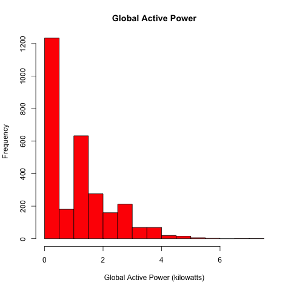
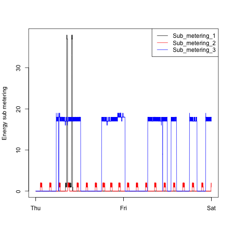
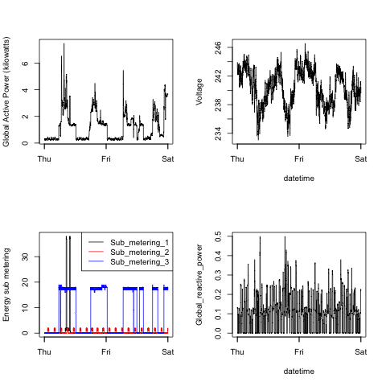

## Introduction

This assignment uses data from
the <a href="http://archive.ics.uci.edu/ml/">UC Irvine Machine
Learning Repository</a>, a popular repository for machine learning
datasets. 

* <b>Dataset</b>: <a href="https://d396qusza40orc.cloudfront.net/exdata%2Fdata%2Fhousehold_power_consumption.zip">Electric power consumption</a> [20Mb]

* <b>Description</b>: Measurements of electric power consumption in
one household with a one-minute sampling rate over a period of almost
4 years. Different electrical quantities and some sub-metering values
are available.

## Included plots

Our overall goal here is simply to examine how household energy usage
varies over a 2-day period in February, 2007. I have reconstructed four plots from Roger Peng's Github repository, which can be found here:

[https://github.com/rdpeng/ExData_Plotting1](https://github.com/rdpeng/ExData_Plotting1)

For each of the four plots, a corresponding R file creates the PNG version of the plot with height and width of 480 pixels. Script `plot1.R` creates the first plot `plot1.png` and so on. The plots are also shown below:

### Plot 1

 

### Plot 2

 

### Plot 3

 

### Plot 4

 

